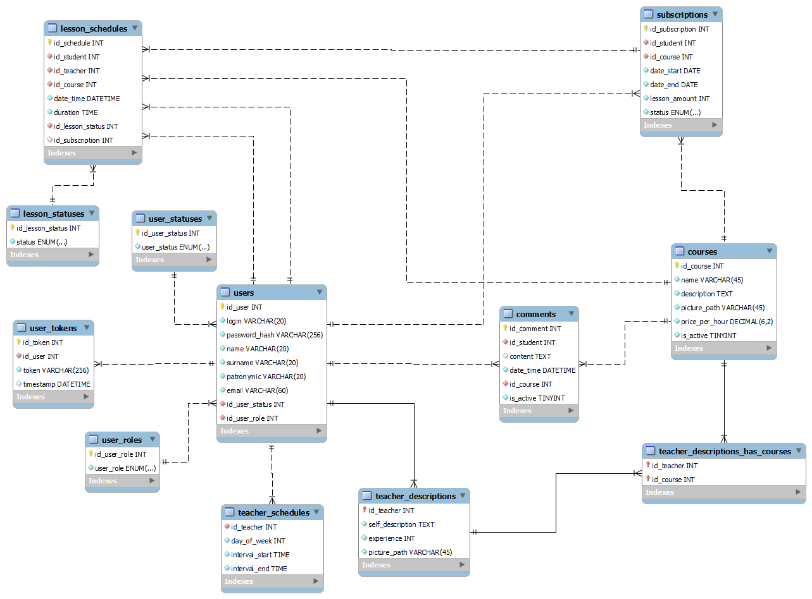

# MuzShock Music Studio Platform

#### The platform allows to administer courses, user subscriptions, classes. Also, the administrator is provided with tools to assess the possibility of approving subscriptions. Teachers have the ability to change their own schedule and profile. Students have the opportunity to sign up for courses and choose a convenient time for classes. Platform offers 4 user roles: Guest, Student, Teacher, Administrator, where Guest is unauthorized user. All users have a possibility to change a language (ru / en) and view courses and teachers of music studio.

### Guest

- Authenticate with login and password
- Sign up with email confirmation
- Request email confirmation resend
- Confirm email via link

### Student

- Submit course comments
- Sign up for courses and select number of lessons
- View personal lesson schedule
- View personal subscriptions and choose teacher and lesson date and time
- Cancel lesson

### Teacher

- Change personal description and update profile image
- Manage personal schedule
  - edit schedule for a week
- View lesson schedule

### Administrator

- Manage users
  - change statuses
  - approve new teachers and admins
- Manage subscriptions
  - approve or reject subscription requests
  - cancel active subscriptions
- Manage lessons
  - cancel lessons
- Manage courses
  - add courses
  - edit courses
  - upload course images
  - assign a teacher to the course
  - change course statuses

